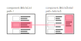

# Step 3

During this workshop we want to create a decoupled news app to read Article nodes from a Drupal backend.

We will create two routes which map to two components:

1. On the route `/` we will just show the article list (`<ArticleList />`)
2. On the route `article/$ID` we will also render the full article (`<ArticleDetail />`)[1](#1)

<a name="1">1</a>: As you can see from the wireframe we want to show the list of articles even on the article detail view so they are navigable without using the back button or an extra menu.
